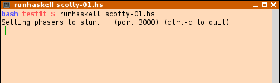

# Counting plankton from microscopic images

## The plan

The plan is to make a computer program to help count plankton from microscopic images. A typical microscopic image may look like this (See figure \ref{plankton}). As much as the goal is to get a functional program, the important part will be the documentation describing the structure and possibilities of the program.


## Background

It all started from the course of Functional programming 1 in spring 2017 (See figure \ref{tiea341}).


# The program

The program should follow the common client and server relation, the client being a web form using JavaScript and the server being programmed in the modern and efficient functional language Haskell.

The web client has already a planned user interface (has it?), with a custom css-file to provide the style of inputs.

## Web client in a browser window


### Basic settings

The basic settings are given in this tab (See figure \ref{base-settings}).


### The taxa

The taxa is chosen in this tab (Figure \ref{taxa}).


### Counting

The actual counting happens in this tab (Figure \ref{counting}). Hotkeys and color coding strongly used. Pictures can be shown and statistical analyses can be made in interaction with the server program. JavaScript programs do not have access to the file system.


## Haskell web server

Web server can be installed in different location or it can be run locally in the same machine as the client. Databases are kept here. Databases can include pictures, counting results, statistics, base information, etc.


# Haskell Scotty web framework

To implement a Haskell web server we have several possibilities for a choise of web framework. In this example we have chosen the Scotty web framework, which is one of the easiest to install and run.

Having the following example code written in source file `scotty-01.hs` we can run it in interpreted mode by the command `runhaskell scotty-01.hs`.



```
{-# LANGUAGE OverloadedStrings #-}
import Web.Scotty

import Data.Monoid (mconcat)

main = scotty 3000 $ do
    get "/:word" $ do
        beam <- param "word"
        html $ mconcat ["<h1>Scotty, ", beam, " me up!</h1>"]
```

After starting the server, we can direct our browser to `localhost:3000`. We can change the route and get a different answer (Figure \ref{scotty-beam}). This is where we can ask Scotty for complicated calculations or pictures.


# Knockout.js

The program for counting plankton runs in a web browser. The functionality of the elements is implemented in JavaScript. We use the open source library Knockout.js. The following are some examples of the functionality from the Knockout.js web page.

## Grid editor example

The grid editor example demonstrates the interaction of page elements (See figure \ref{grid-editor}).


### Source code: View model

```
var GiftModel = function(gifts) {
    var self = this;
    self.gifts = ko.observableArray(gifts);
 
    self.addGift = function() {
        self.gifts.push({
            name: "",
            price: ""
        });
    };
 
    self.removeGift = function(gift) {
        self.gifts.remove(gift);
    };
 
    self.save = function(form) {
        alert("Could now transmit to server: " + ko.utils.stringifyJson(self.gifts));
        // To actually transmit to server as a regular form post, write this: 
        // ko.utils.postJson($("form")[0], self.gifts);
    };
};
 
var viewModel = new GiftModel([
    { name: "Tall Hat", price: "39.95"},
    { name: "Long Cloak", price: "120.00"}
]);
ko.applyBindings(viewModel);
 
// Activate jQuery Validation
$("form").validate({ submitHandler: viewModel.save });
```

### Source code: View

```
<form action='/someServerSideHandler'>
 <p>You have asked for <span data-bind='text: gifts().length'>&nbsp;</span>
    gift(s)</p>
 <table data-bind='visible: gifts().length > 0'>
     <thead>
      <tr>
        <th>Gift name</th>
        <th>Price</th>
        <th />
      </tr>
  </thead>
  <tbody data-bind='foreach: gifts'>
      <tr>
        <td><input class='required' data-bind='value: name, 
                                          uniqueName: true' /></td>
        <td><input class='required number' data-bind='value: price, 
                                                 uniqueName: true' /></td>
        <td><a href='#' data-bind='click: $root.removeGift'>Delete</a></td>
      </tr>
     </tbody>
 </table>

 <button data-bind='click: addGift'>Add Gift</button>
 <button data-bind='enable: gifts().length > 0' type='submit'>Submit</button>
</form>
```


## Paged grid

This is a similar example including a paged grid (See figure \ref{paged-grid}).


### Source code: View

```
<div data-bind='simpleGrid: gridViewModel'> </div>
 
<button data-bind='click: addItem'>
    Add item
</button>
 
<button data-bind='click: sortByName'>
    Sort by name
</button>
 
<button data-bind='click: jumpToFirstPage, enable: gridViewModel.currentPageIndex'>
    Jump to first page
</button> 
```

### Source code: View model

```
var initialData = [
    { name: "Well-Travelled Kitten", sales: 352, price: 75.95 },
    { name: "Speedy Coyote", sales: 89, price: 190.00 },
    { name: "Furious Lizard", sales: 152, price: 25.00 },
    { name: "Indifferent Monkey", sales: 1, price: 99.95 },
    { name: "Brooding Dragon", sales: 0, price: 6350 },
    { name: "Ingenious Tadpole", sales: 39450, price: 0.35 },
    { name: "Optimistic Snail", sales: 420, price: 1.50 }
];
 
var PagedGridModel = function(items) {
    this.items = ko.observableArray(items);
 
    this.addItem = function() {
        this.items.push({ name: "New item", sales: 0, price: 100 });
    };
 
    this.sortByName = function() {
        this.items.sort(function(a, b) {
            return a.name < b.name ? -1 : 1;
        });
    };
 
    this.jumpToFirstPage = function() {
        this.gridViewModel.currentPageIndex(0);
    };
 
    this.gridViewModel = new ko.simpleGrid.viewModel({
        data: this.items,
        columns: [
            { headerText: "Item Name", rowText: "name" },
            { headerText: "Sales Count", rowText: "sales" },
            { headerText: "Price", rowText: function (item) { return "$" 
              + item.price.toFixed(2) } }
        ],
        pageSize: 4
    });
};
 
ko.applyBindings(new PagedGridModel(initialData));
```


